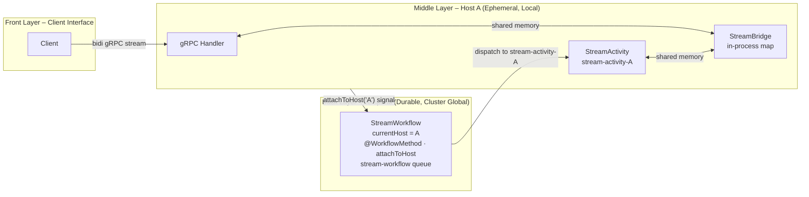

Modern AI agent UX expects streaming: tokens as the model thinks, intermediate reasoning and tool progress as it happens, sub-agent and tool output relayed through the parent, and a side channel for interruption, follow-up input, or human-in-the-loop approval. Most of these are bidirectional. The orchestration around them—retries, tool fan-out, multi-step processing, durable execution, replay on failure—is exactly what Temporal exists for. The question is how to get streaming out of an orchestration substrate that was not designed for it.

It is awkward in four specific ways:

- **Activities are unary.** One call, one return. Emitting one activity per token would drown workflow history.
- **Workers are placement-agnostic by design.** A streaming endpoint is anchored to one host (the one holding the open TCP connection); Temporal task dispatch deliberately is not.
- **Signals and queries are not shaped for byte streams.** Every signal is a history event; queries are point-in-time reads. Neither fits a thousand-event-per-minute token feed.
- **Workflow history is durable.** Streaming output is meant to be ephemeral. Persisting every chunk inverts the cost model.

The conventional fix is a message broker—Kafka, Redis Streams, NATS—and often a KV store on top to remember which host owns which session across reconnections. It works and is well-understood, but it adds a hop, an operational surface, and a coordination service on the hottest path of the request.

This post is about staying inside Temporal. It builds on the SDK's `worker-specific-task-queues` sample and a Temporal community forum discussion on host affinity for in-memory data locality. The placement primitive is from the sample. The contribution is the next move: a long-lived workflow on a general task queue is itself durable, addressable, and signal-able, and can play the role an external service registry would otherwise play. The result is a bidirectional streaming layer that survives host restarts, host removals, and client reconnections with no broker, no cache, and no coordination service.

Treat what follows as a study under a deliberate constraint—no extra broker, no extra cache, no new persistence layer—not a recommendation against the conventional designs. If you already operate a message bus, the conventional design is simpler.

## Background: worker-specific task queues

The standard way to get host affinity in Temporal is the `worker-specific-task-queues` sample: each worker registers a queue named after its host, and dispatchers target a specific queue when they want a specific host. Two properties are worth carrying forward, both surfacing most sharply when the *workflow* is pinned to a host's queue:

- **A pinned workflow becomes stranded when its host goes away.** The queue has no listeners; work scheduled there sits until schedule-to-start timeout fires. The SDK does not auto-rebalance, so recovery typically needs an external coordination layer (a service registry, a Redis mapping) plus operational logic to detect failure and remap.
- **A workflow cannot reserve a worker slot for its lifetime.** Capping concurrent activity slots on a per-host queue does not stop activities belonging to *different* workflows from interleaving on the queue. The basic recipe alone will not keep in-memory state alive across a workflow's full duration.

Both trace back to the same root: pinning the workflow couples its life to a specific machine, while Temporal's failover model assumes workflows are placement-agnostic. Host affinity is not free—it is a deliberate trade.

Streaming endpoints look like the same problem at first glance. The shape is different in one critical way, which the next section exploits.

## The move: the workflow is the registry

The placement model is borrowed from the standard sample:

- The **workflow** runs on a **general task queue**. No host affinity.
- The **activity** runs on a **per-host task queue** (`stream-activity-${HOSTNAME}`). The workflow tells Temporal which queue to dispatch to.

What the sample does not address is what to do when the *target host changes*. The sample assumes a host is discovered once and stays put. In real production environments, the host can change at any time—a client reconnects to a different pod, a host is drained mid-session.

The idea is one observation:

> **Hold the current host as workflow state. Update it via signal. Re-dispatch the activity when it changes.**



That collapses an external coordination problem into a few lines of workflow code. Walk through the four concerns a coordination layer normally owns, and watch each one collapse into something the workflow already does:

- **"Which host owns this session?"**—In the conventional design, a read against Redis or a service registry. Here, the `currentHost` field on the workflow.
- **Updating the mapping on host change.**—In the conventional design, a write to Redis. Here, the body of the `attachToHost` signal handler.
- **Detecting that the previous host is irrelevant.**—In the conventional design, watchdog polling or host-event subscriptions. Here, the workflow cancels its own scope.
- **Routing the next dispatch.**—In the conventional design, read the mapping and build dispatch params. Here, the workflow reads its own field.

No external store, no operator step to detect failure, no separate API. Everything stays inside Temporal and inherits its durability and observability.

This works because streaming fits the shape of *one long-lived workflow per session*. The workflow's lifetime is the session's lifetime, so there is exactly one durable mapping for as long as it is needed. The limitation when this shape does not fit is covered below.

## Reference implementation: gRPC bidirectional streaming

gRPC bidi exercises both directions of the bridge. SSE drops in as a one-way specialization (no `onRequest` half).

### The bridge

The gRPC handler and the activity run in the same process on the same host—that is what the placement model guarantees. The bridge between them is therefore just shared memory: a connection-keyed handle that both sides write to and read from. The reference snippets are Java, but nothing about this depends on the runtime—a Python or Go service that co-locates its gRPC server with its Temporal worker has the same property.

The contract is small:

```java
interface StreamBridge {
  Entry getOrCreate(String key);
  Optional<Entry> get(String key);
  void remove(String key);

  interface Entry {
    void registerNetwork(Consumer<String> onResponse, Runnable onComplete);
    void clearNetwork();                       // disconnection: pause, not teardown
    void registerActivity(Consumer<String> onRequest);
    void sendResponse(String response);        // worker → client
    void onRequest(String request);            // client → worker
  }
}
```

Any in-process mechanism with this shape works. A few options:

- **Direct callback registry** *(reference implementation)*. A `ConcurrentHashMap<String, Entry>` with synchronized `Consumer` fields. Lowest latency; no buffering or backpressure.
- **Reactive sink.** `PublishSubject<String>` (RxJava) per direction. Configurable overflow strategies—drop oldest, drop latest, fail—when the producer outpaces the consumer.
- **Python.** `asyncio.Queue` per direction, indexed by connection key. Built-in backpressure; idiomatic in async Python services.

The only properties this design relies on are: in-process, keyed by connection identifier, and a non-destructive `clearNetwork` so disconnection is a pause rather than a teardown—that is what lets reconnection be a routine re-attach.

### The gRPC handler

```java
public StreamObserver<InvokeStreamRequest> invokeStream(
    StreamObserver<InvokeStreamResponse> responseObserver
) {
  AtomicReference<String> connectionKey = new AtomicReference<>();

  return new StreamObserver<>() {
    @Override public void onNext(InvokeStreamRequest request) {
      String key = request.getInput();
      if (connectionKey.compareAndSet(null, key)) {
        bridge.getOrCreate(key).registerNetwork(
            response -> responseObserver.onNext(
                InvokeStreamResponse.newBuilder().setOutput(response).build()),
            responseObserver::onCompleted);
        StreamWorkflow workflow = workflowClient.newWorkflowStub(
            StreamWorkflow.class,
            WorkflowOptions.newBuilder()
                .setTaskQueue("stream-workflow")  // global, not host-pinned
                .setWorkflowId(key)
                .build());
        try {
          WorkflowClient.start(workflow::execute, key);
        } catch (WorkflowExecutionAlreadyStarted ignored) {
          // reconnection path: workflow is already running.
        }
        workflow.attachToHost(System.getenv("HOSTNAME"));
      }
      bridge.get(key).ifPresent(entry -> entry.onRequest(request.getInput()));
    }
    @Override public void onError(Throwable t) {
      String key = connectionKey.get();
      if (key != null) {
        bridge.get(key).ifPresent(StreamBridge.Entry::clearNetwork);
      }
    }
    @Override public void onCompleted() {
      String key = connectionKey.get();
      if (key != null) {
        bridge.remove(key);
        workflowClient.newUntypedWorkflowStub(key).cancel();
      }
    }
  };
}
```

Two design choices to call out:

- `onError` does not remove the bridge entry or cancel the workflow. Disconnection is a pause, not an end.
- The first `onNext` calls `attachToHost(HOSTNAME)`. Initial connection: it is the initial attach. Reconnection: it triggers a host switch.

### The workflow

```java
@WorkflowInterface
public interface StreamWorkflow {
  @WorkflowMethod
  void execute(String connectionKey);

  @SignalMethod
  void attachToHost(String hostId);
}

public class StreamWorkflowImpl implements StreamWorkflow {
  private String currentHost;
  private CancellationScope currentScope;

  @Override
  public void execute(String key) {
    while (true) {
      Workflow.await(() -> currentHost != null);
      String dispatchHost = currentHost;
      currentScope = Workflow.newCancellationScope(() -> {
        StreamActivity activity = Workflow.newActivityStub(
            StreamActivity.class,
            ActivityOptions.newBuilder()
                .setStartToCloseTimeout(Duration.ofHours(1))
                .setHeartbeatTimeout(Duration.ofSeconds(30))
                .setTaskQueue("stream-activity-" + dispatchHost)
                .build());
        activity.execute(key);
      });
      try {
        currentScope.run();
        return;  // activity completed normally → stream done.
      } catch (CanceledFailure e) {
        // attachToHost asked us to switch hosts; loop and re-dispatch.
      } catch (ActivityFailure e) {
        // The host died or its worker became unreachable.
        // Wait until a reconnection points us at a different host.
        Workflow.await(() -> !Objects.equals(currentHost, dispatchHost));
      }
    }
  }

  @Override
  public void attachToHost(String hostId) {
    if (Objects.equals(hostId, currentHost)) return;
    currentHost = hostId;
    if (currentScope != null) currentScope.cancel();
  }
}
```

The workflow waits for an initial `attachToHost`, dispatches an activity to that host's queue inside a cancellation scope, and loops. Two failure paths return to the loop: `CanceledFailure` (a different host signaled in) re-dispatches immediately; `ActivityFailure` (the host's worker became unreachable) blocks the loop until `currentHost` changes. Both are walked through in the recovery section below.

### The activity

```java
public class StreamActivityImpl implements StreamActivity {
  private final StreamBridge bridge;

  @Override
  public void execute(String key) {
    StreamBridge.Entry entry = bridge.getOrCreate(key);
    entry.registerActivity(req -> handleClientRequest(req));
    try {
      for (String chunk : chunkSource(key)) {            // e.g. LLM token stream, tool output
        entry.sendResponse(chunk);
        Activity.getExecutionContext().heartbeat(null);   // throws on cancel; stops the loop
      }
    } finally {
      bridge.remove(key);
    }
  }
}
```

Each pod boots two workers with deliberately non-overlapping responsibilities—the global worker handles workflow tasks only, and the host-pinned worker handles activity tasks only. Each disables the other's task type via `WorkerOptions` so a misregistered class can't silently cross the boundary:

```java
// Global worker: workflow tasks only. Activity slots set to 0 so it never picks up activities.
Worker globalWorker = workerFactory.newWorker(
    "stream-workflow",
    WorkerOptions.newBuilder()
        .setMaxConcurrentActivityExecutionSize(0)
        .build());
globalWorker.registerWorkflowImplementationTypes(StreamWorkflowImpl.class);

// Host-pinned worker: activity tasks only. Workflow slots set to 0 so it never picks up workflows.
Worker hostWorker = workerFactory.newWorker(
    "stream-activity-" + System.getenv("HOSTNAME"),
    WorkerOptions.newBuilder()
        .setMaxConcurrentWorkflowTaskExecutionSize(0)
        .build());
hostWorker.registerActivitiesImplementations(streamActivityImpl);
workerFactory.start();
```

The split matters. The workflow runs on a cluster-wide queue and must be free to land anywhere; the activity must be the only thing competing for slots on its host's queue, since those slots are what hold the live connection. Mixing the two responsibilities on one worker would let activity load throttle workflow scheduling, or vice versa.

## Failure modes and recovery

Two failure modes are worth walking through. They differ in what is alive at the moment of failure, but both are resolved by the same mechanism: a reconnecting client signaling `attachToHost`. Nothing outside Temporal participates in either path.

### Scenario 1: the host running the activity goes offline

Host A dies while running the activity. The TCP connection and the activity terminate together—the connection is severed mid-flight; the activity stops heartbeating.

1. The client sees a read error.
2. Temporal's heartbeat timeout fires; the activity attempt fails.
3. The retry policy (if any) re-dispatches to `stream-activity-A`, which has no listener; schedule-to-start timeout fires; that attempt fails too.
4. `currentScope.run()` in the workflow throws `ActivityFailure`.
5. The workflow's `catch (ActivityFailure)` block runs `Workflow.await(() -> !Objects.equals(currentHost, dispatchHost))`. The workflow is now alive but blocked, waiting for someone to tell it where to dispatch next.

The workflow does not probe the cluster, query a service registry, or pick a fallback host. It cannot usefully do any of those things—an activity dispatched to a host with no live gRPC connection produces output into a bridge entry no consumer will ever read. The only meaningful "next host" is the host the client reconnects to.

When the client reconnects, the load balancer routes them to whatever host is convenient (call it host D). Host D's gRPC handler signals `attachToHost("D")`. `currentHost` changes, the await releases, the loop re-runs, and the workflow dispatches a new activity to `stream-activity-D`. The new activity binds to the bridge entry that host D's handler just created, and streaming resumes.

**The recovery is driven entirely by the reconnection. The workflow's job is to wait for it.**

### Scenario 2: the gRPC connection drops, the host is fine

The TCP stream drops (network glitch, suspended tab, load-balancer drain) but host A is healthy and the activity is still running.

1. `onError` clears network callbacks on the bridge entry; the entry itself stays.
2. The activity continues; `sendResponse` becomes a silent no-op until a new handler attaches.
3. The workflow is unaffected. `currentScope.run()` is still blocked on the activity stub call.

When the client reconnects, two sub-cases:

- **Reconnects to the same host (A).** The new gRPC handler installs `registerNetwork` on the existing bridge entry. It signals `attachToHost("A")`, which is a no-op because `currentHost` is unchanged. Output resumes through the activity that has been running the whole time.
- **Reconnects to a different host (D).** Host D's handler installs `registerNetwork` on host D's local bridge and signals `attachToHost("D")`. The workflow updates `currentHost`, cancels the scope, and re-dispatches to `stream-activity-D`. The activity on host A throws `ActivityCanceledException` on its next heartbeat, exits, and removes its local bridge entry. The activity on host D binds to the new entry and resumes.

The activity's lifetime is decoupled from the connection's. Disconnection does not kill it; reconnection routes it.

### What both scenarios share

In both flows the workflow's `currentHost` field is the registry, the `attachToHost` signal is the rebalancing API, and the reconnecting client is the authority on where the next activity should run. The workflow never needs cluster awareness; it just needs a signal. The session is the workflow (durable, host-agnostic, signal-able). The activity is the current edge of that session (ephemeral, host-pinned, replaceable). Recovery—whether from a lost connection or a lost host—is a signal that moves the edge.

## Why not signals for the byte stream itself?

Signals are durable control messages, not transport:

- Each signal is a workflow history event. A 30-minute stream at one chunk per second produces 1,800 history events per stream.
- Signals are persisted; streaming output is not worth persisting.
- Signals add a Temporal round-trip per message. Pinning the activity to the host exists precisely to keep the data path off the network.

Signals are right for `attachToHost`, `cancel`, and `tool-finished`. They are wrong for the byte stream.

## Limitations

**Activities must be cancellable.** Reconnection depends on regular `heartbeat()` calls and cancellation propagation. Long uninterrupted blocking calls delay reconnection until they finish.

**State during the disconnection gap is implementation-specific.** Three options: drop chunks, buffer them up to some bound, or pause the activity. Choose per use case.

**Connection key uniqueness is the client's problem.** Workflow ID collisions fail loudly. For external callers, generate the key server-side.

**Recovery requires the client to reconnect.** If the host running the activity dies and no client reconnects, the workflow stays alive but blocked, waiting for an `attachToHost` signal that never arrives. The design intentionally does not have the workflow probe for fallback hosts on its own—without a live connection there is no useful host to choose. Workflow execution timeout (if configured) is the long-stop.

**The pattern requires a long-lived workflow per session.** The workflow-as-registry trick depends on a single workflow whose lifetime spans the session it tracks. Streaming naturally fits this shape. Architectures structured as many short workflows (a fresh workflow per iteration) do not get the benefit directly—adopting it there means restructuring into long-lived workflows that dispatch iterations as activities.

**This is a Temporal-only experiment.** If you already operate a message bus, the conventional pub/sub design is simpler.

## Takeaways

1. **The workflow can be the registry.** A long-lived workflow on a general queue, with a `@SignalMethod`, replaces the external KV-plus-watchdog combination most coordination layers exist to provide.
2. **Reconnection is the load-bearing test.** Host-pinned placement on its own gets a stream that works while nothing fails. Signal-driven re-attach is what lets it survive host churn without external help.
3. **Streaming and durability live at different layers.** Byte stream: ephemeral, in-process, host-local. Orchestration: durable, retryable, cluster-global. Each stays where it is good.

The conventional broker-based answer remains the right default for most teams. The point of this design is what becomes possible when you lean on Temporal for one more thing than you thought you could.
