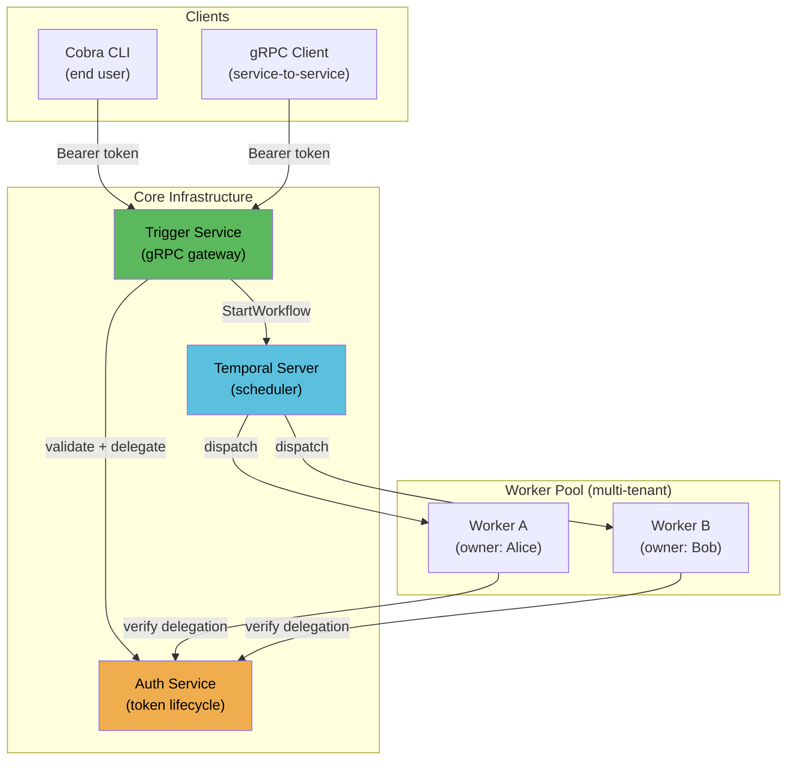
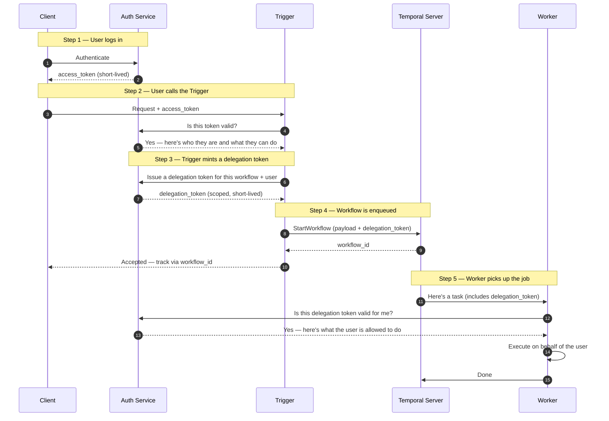
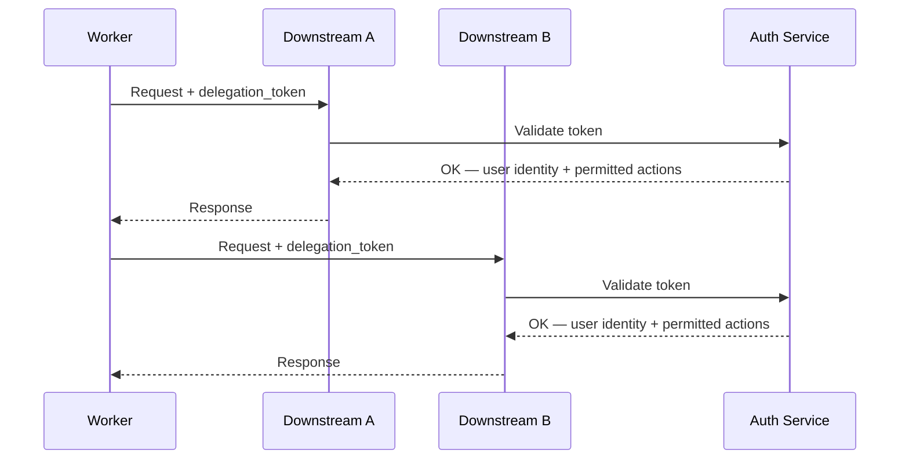
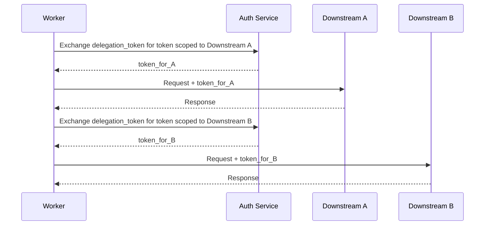

When you build a service on top of Temporal, you quickly run into a problem that pure
request/response systems never have to deal with: **the person who kicked off the work
is no longer in the room when the work actually happens.**

A user hits your trigger, your trigger hands a task to Temporal, and then some worker —
maybe running on someone else's infrastructure, maybe hours later — picks it up and
executes it. How does that worker know who originally asked for this? How does it know
what that person is allowed to do? And how do you prevent one tenant's worker from
accidentally (or maliciously) picking up another tenant's jobs?

This post walks through a practical design that answers those questions.

## The Setup

The system has five moving parts:

- **Client** — a Cobra CLI or any gRPC client calling on behalf of a user
- **Trigger** — the single front door; every request enters through here
- **Auth Service** — the single authority for issuing, validating, and revoking tokens
- **Temporal Server** — schedules work and fans it out to workers
- **Workers** — multiple instances, each owned by a different operator, each isolated to their own task queue

The interesting constraint is the last one. Alice runs Worker A. Bob runs Worker B.
Neither should ever touch the other's jobs — and neither should be able to act in ways
the original caller didn't authorize.

## The Core Idea: Delegation Tokens

This design is inspired by Kerberos. In Kerberos, a trusted Key Distribution Center
issues a short-lived, scoped Service Ticket that lets a client act on a specific service
without re-presenting its original credentials. The same principle applies here: the
Auth Service plays the role of the KDC, the `access_token` is the equivalent of a
Kerberos TGT, and the delegation token is the Service Ticket — scoped to one workflow
run and verified by the Worker before any work begins. The key difference is that this
design is built for an async, distributed environment rather than a live network session,
so the "ticket" rides through Temporal's workflow payload instead of a direct connection.

The solution is to separate two concerns that often get conflated:

- **Who are you?** — proven by an `access_token` the user presents at the Trigger
- **What are you allowed to do, and on whose behalf?** — proven by a `delegation_token`
  the Trigger mints and tucks into the Temporal workflow payload

Think of the delegation token like a signed work order. The Trigger stamps it with the
user's identity, the specific job to be done, and which worker pool is authorized to
touch it. When a Worker picks up the job, it checks the work order against the Auth
Service before doing anything. If the order is valid and addressed to that worker, it
proceeds. Otherwise, it refuses.

This means the Worker never needs to know the user's real credentials. It just needs to
trust the work order — which it can verify independently.

## The Request Flow

Here's what happens end-to-end when a user fires a request:

The delegation token is the bridge between the synchronous world (the user's request)
and the asynchronous world (the worker executing later). It carries just enough context
— user identity, permitted actions, which worker pool owns this task — without exposing
anything sensitive.

## What Happens When the Worker Calls Downstream Services

In practice, a Worker rarely does everything itself. It often needs to call other
APIs — owned by different teams or organizations — to complete the job. Those downstream
services may also require a token in the request header or payload to authenticate the
caller and authorize the operation. So the question becomes: can the Worker just forward
the delegation token it already has?

The short answer is yes, but the right choice depends on where those downstreams live
and how much you trust them.

### Option 1: Token Forwarding

The Worker passes the delegation token as-is to each downstream API. The downstream
validates it against the same Auth Service and learns who the original user was and what
they're permitted to do.

**When this makes sense:**
- All downstreams are internal services within the same trust boundary
- The team operating each downstream trusts the Auth Service as the common authority
- You want simplicity and minimal latency overhead

**The risk:** the delegation token was scoped to the workflow, but it's now also
authenticating calls to multiple other services. If a downstream is compromised, it
holds a token that can be replayed elsewhere within its validity window.

### Option 2: Token Exchange (Per-Service Tokens)

Instead of forwarding, the Worker exchanges the delegation token for a new, narrower
token specific to each downstream. The Auth Service issues a short-lived token that only
works for that one service and only allows what that service needs.

This is the same principle Kerberos uses — you get a fresh Service Ticket for each
service you want to talk to, scoped exactly to that conversation.

**When this makes sense:**
- Downstreams cross organizational boundaries — different teams, external partners, or
  third-party APIs that shouldn't see a token valid across your whole system
- Least-privilege is a firm requirement and each downstream should only be able to do
  exactly what it's been granted
- You need independent revocation per downstream relationship

**The tradeoff:** an extra round-trip to the Auth Service before each downstream call.
For workflows with many downstream hops, this adds up.

### A Middle Ground

If you want to avoid per-call exchanges but still limit blast radius, forward the
delegation token but make its `permitted_actions` claims granular enough that each
downstream only honors the subset relevant to it. The token carries the full picture;
each consumer enforces its own slice. This is simpler than token exchange but requires
every downstream to implement claim-aware authorization rather than just validating the
token signature.

## Keeping Tenants Isolated

Each worker owner registers their Worker against a dedicated task queue (`queue-alice`,
`queue-bob`, etc.). The delegation token specifies which queue is authorized for that
job, so Temporal only dispatches the task to the right pool.

A Worker that receives a task whose delegation token doesn't match its own queue identity
simply rejects it. This means a misconfigured or compromised Worker in one tenant's pool
cannot process another tenant's work even if it somehow connects to the same Temporal
namespace.

## Alternative Approaches

The design above is pragmatic and easy to implement, but it's not the only way. Here are
four other approaches worth knowing about.

### OAuth 2.0 Token Exchange (RFC 8693)

This is the "by the book" version of delegation. Instead of inventing a custom delegation
endpoint, the Trigger uses a standardized OAuth grant type to exchange the user's token
for a scoped, delegated one. If you're already running Okta, Keycloak, or another
enterprise IdP, this slots in naturally and keeps everything interoperable.

The tradeoff: it's heavier to implement and assumes a fully spec-compliant authorization
server. Great for teams with existing OAuth infrastructure; overkill if you're starting
from scratch.

### Macaroons

Macaroons are an alternative to JWTs that let you attach unforgeable constraints
("caveats") to a token after it's been issued. The Trigger could take a user's token
and narrow it — adding a caveat that says "this is only valid for workflow X, for the
next 30 minutes" — without calling back to the Auth Service. Workers verify the caveat
chain locally.

The benefit is fewer network round-trips. The downside is that revocation gets harder,
and macaroons are much less familiar to most engineers than JWTs.

### SPIFFE / SPIRE (Workload Identity)

Instead of issuing tokens to Workers manually, SPIRE automatically injects a
cryptographic identity into each Worker process based on where it's running
(Kubernetes pod, VM, etc.). Workers prove who they are via that identity, and the Auth
Service checks whether that workload is allowed to process tasks for a given user.

This approach eliminates secret management for Workers entirely — no tokens to rotate,
no credentials to leak. It's the gold standard for service mesh environments. The
tradeoff is significant infrastructure overhead; SPIRE is not a small operational lift.

### Open Policy Agent (OPA)

Rather than baking authorization logic into each service, you push all policy decisions
to a centralized OPA instance. The Trigger and Workers ask OPA "is this allowed?" and
OPA evaluates a policy written in its Rego language.

This gives you auditable, testable, version-controlled policy separate from application
code — very appealing as a system grows. The cost is another service to operate and a
policy language to learn.

## How the Approaches Compare

| | JWT Delegation *(primary)* | OAuth RFC 8693 | Macaroons | SPIFFE/SPIRE | OPA |
|--|--|--|--|--|--|
| Easy to implement | Yes | Medium | Medium | No | Medium |
| Works without external IdP | Yes | No | Yes | Yes | Yes |
| Offline token verification | No | No | Yes | Yes | No |
| Strong revocation | Yes | Yes | Partial | Yes | Yes |
| Multi-tenant isolation | Yes | Yes | Yes | Yes | Yes |
| Operational overhead | Low | Medium | Medium | High | Medium |

## Things to Get Right

A few things that matter regardless of which approach you pick:

**Keep delegation tokens short-lived.** They should expire before or when the workflow
completes. An unconstrained delegation token is a loaded gun.

**Scope them tightly.** A delegation token should name the specific workflow it's valid
for. A generic "act as user X" token defeats the whole model.

**Audit everything.** Every token issuance, validation, and revocation should produce a
structured log entry. When something goes wrong — and it will — that trail is what you
have.

**Encrypt the Temporal payload.** Temporal Server operators can read workflow inputs.
If your delegation token contains sensitive claims, either encrypt the payload or use
Temporal's Data Converter to handle it transparently.
