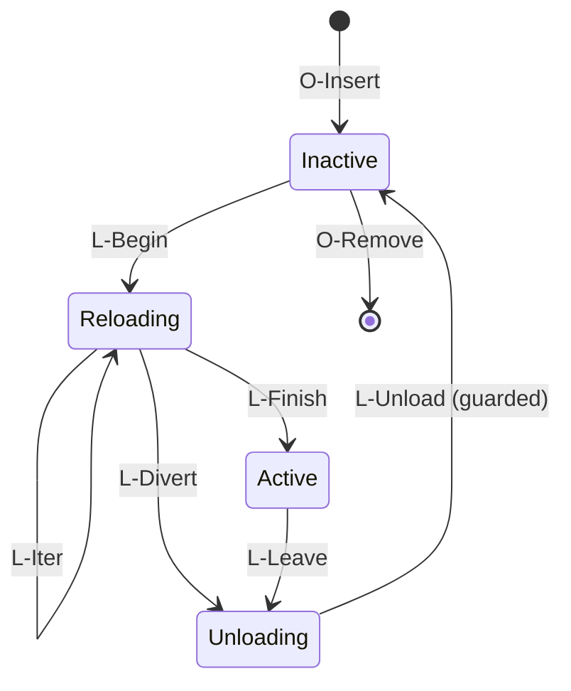
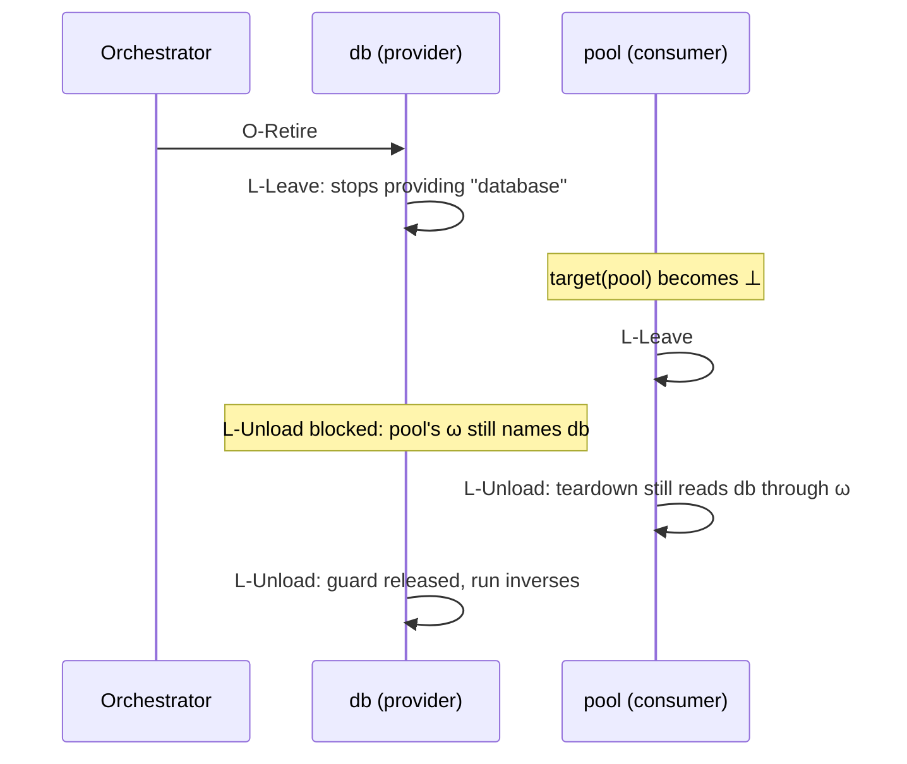

This is the second of two posts on [*A Programming Paradigm for Spatiotemporal Composability*](https://arxiv.org/abs/2608.25512) by Yifan Shi, Wei Zhang, and Tianyi Cui. [The first post]() showed the agent in [DeepSeek Harness](https://github.com/deepseek-ai/deepseek-harness) building and removing its own UI, and gave the paper's big ideas: revertible effects and reactive coeffects. This post goes into the details. I'll cover the notation, the small calculus the paper builds, the theorems and why they hold, how Cordis implements it all, and what it looks like in real DeepSeek Harness code.

If you haven't read the first post, I'd start there. This one assumes you know what revertible effects and reactive coeffects are.

## The notation

### Typing judgments

Type systems are written as *judgments*:

$$
\Gamma \vdash t : T
$$

You read this as "in context $$\Gamma$$, the term $$t$$ has type $$T$$." The context $$\Gamma$$ is everything in scope: the variables the term can use and their types. For example, `x: Int, y: Int ⊢ x + y : Int`.

A plain type tells you what a computation returns. It tells you nothing about what the computation does to the world, or what it needs from the world. Effects and coeffects add exactly these two things, one on each side of the turnstile.

### Effect and coeffect judgments

An effect system adds the side effects to the result:

$$
\Gamma \vdash t : T \;!\; \varepsilon
$$

Here $$\varepsilon$$ comes from an *effect algebra*, for example a set like `{io, exn, state}`. Running two computations in a row combines their effects, usually by union.

A coeffect system annotates the context instead:

$$
\Gamma \,@\, r \vdash t : T
$$

Here $$r$$ describes what the computation needs from its environment.

## Revertible effects, formally

### An effect returns its inverse

Remember the State monad's shape, `S → (A, S)`. The paper drops the return value, since it only cares about the change to the context, and adds an inverse. An effect is a function

$$
\Gamma \to \Gamma \times (\Gamma \to \Gamma)
$$

Given the current context, it returns the new context and a function that undoes the change. Since the inverse is handed back to the runtime, the runtime can track the effect. And since the inverse exists, the effect can be reverted.

### The accumulator

The runtime keeps an **effect context**. It's a pair of the current state $$\gamma$$ and an **accumulator** $$\varphi$$, which is all the inverses collected so far, composed together. Two operations work on it:

$$
\mathrm{track}(f, g) : (\gamma, \varphi) \mapsto (f(\gamma),\; \varphi \circ g)
\qquad
\mathrm{recover} : (\gamma, \varphi) \mapsto (\varphi(\gamma),\; \mathrm{id})
$$

`track` runs `f` and adds its inverse `g` to the accumulator. `recover` runs all the stored inverses and resets the accumulator. Each new inverse is composed on the inside (`φ ∘ g`), so it runs first. That means recovery is last in, first out, just like nested `finally` blocks.

Three small theorems make this safe to rely on:

- **Tracking doesn't change behavior** (Theorem 4). On the state, `track(f, g)` does exactly what `f` does.
- **Tracking composes** (Theorem 5). Tracking two effects one by one is the same as tracking their combination once. Formally, `track` is a *monoid homomorphism* from "twisted composition" (forward functions compose one way, inverses compose the other way) to transformations of the effect context.
- **The soundness invariant** (Theorem 7). If each inverse undoes its own step, then $$\varphi(\gamma) = \gamma_0$$ holds at every point. Running the accumulator always takes you back to where you started.

### Two refinements

**An inverse only has to work where it was created.** The inverse is returned when the effect runs, so it can capture what it needs. It says "remove listener #42", not "remove whatever listener is there." It only has to satisfy $$g(\delta) = \gamma$$ at the one state where the effect ran. The paper calls an effect with this guarantee *witnessed*.

**Effect iterators.** A component's setup is a sequence of effects, so the paper models it as an iterator. Each step gives the new context, an inverse, and a continuation (`Nothing` means done). In Cordis this is just the generator from the first post:

```ts
ctx.effect(function* () {
  const id = registry.add(entry)
  yield () => registry.remove(id)   // inverse for step 1
  const off = events.on('message', handler)
  yield () => off()                 // inverse for step 2
})
```

The gap between two steps is a clean place to cancel. If a component has to stop halfway through loading, the accumulator holds exactly the inverses collected so far, and running it undoes exactly what was done.

## Reactive coeffects, formally

### The coeffect context

Dependency injection containers usually model dependencies as a key-value map. The paper formalizes this map as the **coeffect context** Σ. It's a finite partial function from keys to typed values, like `database ↦ DbClient` or `http ↦ Server`. Two operations work on it:

- `get(k)` reads the value at `k`. The key must be present.
- `set(k, v)` binds `v` at `k`. The key must be absent, because a key can't be provided twice. And `set` returns an inverse that deletes `k`.

That last point is how the two halves of the paper connect. Providing a service is itself a revertible effect, so when a provider unloads, its services are removed automatically.

### Specification and notification

A component declares a **specification** $$d$$, which is the set of keys it needs. A context satisfies it when every key is present:

$$
\sigma \models d \;\iff\; \forall k \in d.\; k \in \mathrm{dom}(\sigma)
$$

Then for every change to the context, from $$\sigma$$ to $$\sigma'$$, the runtime puts each component into one of three cases:

- **Activating**: $$d$$ wasn't satisfied before and is now. Run the component's effects.
- **Deactivating**: $$d$$ was satisfied before and isn't now. Run its accumulator.
- **Neutral**: nothing changed for this component.

## The context paradigm

### Everything goes through the context

The paper combines the effect machinery and the coeffect table into one recursive type:

$$
\Gamma_\infty = \mu\Gamma.\; \Gamma \times (\Gamma \to \Gamma) \times \Sigma
$$

Then it adds the rule from the first post: all shared mutable state must be bound to some key. A component can only act in a few ways: run an operation on a key it declared, provide a key it owns, or start a child component. If a component touches anything outside the context, that action isn't tracked, and the guarantees don't cover it. This rule is what lets the runtime know which component did each action.

Two problems come up once you take this rule seriously.

### Real undo isn't exact

`free` doesn't bring back the heap layout from before `malloc`. A freshly generated name doesn't come back when you undo whatever created it. So asking for exactly equal states is too strict. Instead, the paper compares states by **observational equivalence**. Two values at a key are equivalent if no sequence of that key's public operations can tell them apart. Every equation in the paper should be read "up to" this relation.

### Removing a component out of order

The first post covered the A-then-B case: A loads, B loads, and then A is removed while B stays. A's inverses run on a state B has also changed. This only works if A's and B's effects commute. The paper calls this *independence*. Theorem 43 shows that if effects are pairwise independent, their inverses can run in any order and still get back to the start.

So how do you get commutation in practice?

- **Operations on different keys always commute** (Theorem 45), because each one only touches its own key.
- **Within one key, commutation is the provider's job.** Each key comes with a *witness* that its operations commute, and whoever defines the key supplies it. Whether a key commutes depends on what its interface lets callers see:
  - ✅ A table where each registration gets a fresh id, like routes or event listeners. Either order gives tables that no operation can tell apart, and you can remove either entry on its own. (CRDTs tag every insert for the same reason.)
  - ❌ An ordered middleware chain. The insertion order changes behavior.
  - POSIX has both cases. `open` must return the lowest free file descriptor, so two `open`s don't commute. `mmap` can return any free address, so it does.

The design lesson: expose less ordering in your interface, and more of your operations will commute. If order really matters, express it as a dependency between components instead of hiding it in effects.

## The calculus

This is the core of the paper. Sections 3.1 to 3.4 give local guarantees about one component. Section 4 builds a small operational calculus and proves that those guarantees still hold when many components interleave in any order.

### The objects

A **component** is a triple $$(d, p, e)$$:

- $$d$$: the keys it needs (its specification)
- $$p$$: the keys it may provide (its provision)
- $$e$$: its witnessed effect iterator

A **fiber** is one running instance of a component. The name comes from lightweight threads. It's a tuple $$\langle d, p, e, \pi, \sigma, \tau, \theta \rangle$$:

| Field | Meaning |
|---|---|
| $$d, p, e$$ | From the component |
| $$\pi$$ | Parent fiber, or `root`. Fibers form a tree. |
| $$\sigma$$ | The fiber's own table of provided bindings |
| $$\tau$$ | Retirement flag. It's set once the orchestrator asks the fiber to go away. |
| $$\theta$$ | Lifecycle state: `Inactive`, `Reloading(i, g, ω)`, `Active(g, ω)`, or `Unloading(g, ω)` |

Inside the lifecycle state, `i` is the remaining iterator, `g` is the accumulator, and `ω` is the **committed view**. The committed view maps each declared key to the name of the fiber that provided it when activation started.

The **registry** maps fiber names to fibers. The coeffect context isn't stored anywhere. It's derived: it's the union of the tables of all `Active` fibers. Two things follow from this one definition:

1. A fiber stops providing its services as soon as it leaves `Active`, before it has undone anything.
2. Different fibers must provide disjoint sets of keys (the *single-source discipline*), so each key has at most one possible provider.

### Target view vs. committed view

Each fiber is always compared against its **target view**, which is where it should be:

- If the fiber is retired, or its specification isn't satisfied, the target is ⊥. It shouldn't run.
- Otherwise, the target maps each declared key to the name of its current provider.

The committed view `ω` records the target the fiber activated against. Every lifecycle rule fires based on whether these two match. The view records the provider's name, not its value, and that matters. If a provider is replaced by a different fiber that offers an equal value, dependents still notice and rebuild.

A state is **quiescent** when every fiber has settled at its target. That means each fiber is either `Inactive` with target ⊥, or `Active` with target = ω.

### The nine rules

Three orchestration rules are the only outside inputs. The orchestrator asks for things, but it never sets a lifecycle state directly:

| Rule | Premise | Effect |
|---|---|---|
| O-Insert | Fresh name; parent exists; provision disjoint from every existing fiber's | Add an `Inactive` fiber |
| O-Retire | Fiber exists | Set τ (a request that the lifecycle rules carry out) |
| O-Remove | Retired, `Inactive`, empty table, no children | Delete the fiber |

Six lifecycle rules fire on their own whenever their premises hold:

| Rule | From → To | Premise | What happens |
|---|---|---|---|
| L-Begin | `Inactive` → `Reloading` | Target ≠ ⊥ | Commit ω := target; start the iterator |
| L-Iter | `Reloading` → `Reloading` | Target still = ω | Run one step; add its inverse to `g` |
| L-Finish | `Reloading` → `Active` | Target still = ω; last step | Run the last step; start providing |
| L-Divert | `Reloading` → `Unloading` | Target ≠ ω | Give up the load, keeping the inverses so far |
| L-Leave | `Active` → `Unloading` | Target ≠ ω | Stop providing, but don't undo anything yet |
| L-Unload | `Unloading` → `Inactive` | No other installed fiber's ω names this fiber | Run the accumulator; drop ω |



Two design choices in these rules do most of the work.

**Deactivation takes two steps, and the second one is guarded.** Think of a connection pool whose teardown returns connections to the database that provided them. The pool still needs to use the database during its own teardown, so the database must not go away first. L-Leave records the decision: the provider stops providing, so its dependents' targets change right away. L-Unload actually runs the inverses, but only once no installed fiber's committed view names this fiber anymore. The paper calls this premise **the guard**.



Guards like this often cause deadlocks, but this one doesn't. A provider in `Unloading` is already invisible, so no new fiber can commit to it, and every fiber that already did is on its way out.

**L-Divert can fire between any two iterations.** If a component is halfway through loading and its dependency disappears, it goes straight to `Unloading`. It never passes through `Active`, so no dependent ever binds to a component that is already leaving.

Finally, the rules don't mention a scheduler. Any order of rule applications is legal. So every guarantee below holds for any scheduling policy a runtime might pick.

## The theorems and why they hold

The first post listed the guarantees in plain words. Here I'll go through each one with the idea behind its proof. First, there's one more constraint the proofs need, and a common setup they all share.

### Confinement

An effect function must be **confined** to its fiber. It can write only its own table, plus values (but not presence) at keys it declared in its provider's table. It can read only those same two parts. It can't read or write any lifecycle state, any control field, or any table outside its declarations. Lemma 57 shows that any iterator built from the allowed stages (operation, provision, instantiation) is automatically confined. This is what lets the proofs treat the rules as a complete list of everything that can change.

### How the proofs are set up

All the proofs use the same technique. Every step splits into two parts:

$$
\gamma_{t+1} = \mathrm{edit}_t(\Psi_t(\gamma_t))
$$

Here $$\Psi_t$$ is the *state map* (an iteration, the accumulator, or the identity), and $$\mathrm{edit}_t$$ writes *control fields* (lifecycle state, retirement flag, registry membership). State maps only change tables, and edits only change control fields. The paper's Table 1 lists, for each rule, which `Ψ` it applies and which fields it edits. Almost every case in the proofs is just a lookup in that table.

A few supporting lemmas follow right away:

- **Who writes what** (Lemma 59). Only L-Begin creates a committed view, and only L-Unload destroys it. So the view stays constant over a fiber's whole *episode*, meaning the time it is installed. Only L-Unload applies an accumulator. And τ only goes one way: once it's set, it stays set.
- **≃-invariance** (Lemma 60). The rules can't tell observationally equivalent states apart.
- **Equivariance** (Lemma 61). Fiber names are atoms, so renaming them consistently changes nothing. This lets results be stated "up to renaming."

### Preservation (Theorem 64)

In plain words: the registry always stays well-formed, and no committed view ever points to a fiber that is gone.

**Claim.** Every rule keeps the registry well-formed. Parent pointers point into the registry. Provisions don't overlap. An installed fiber's committed view covers its whole specification. And every fiber named in an installed committed view is itself installed.

**Why.** You check it rule by rule using Table 1. The interesting part is the last clause, and the guard is what makes it hold. L-Unload can't fire while anyone's view names the fiber, so no committed view ever points to a fiber that is gone. As a bonus, a removed fiber's name can safely be reused.

### Recovery exactness (Theorem 68 and Corollary 69)

In plain words: unloading a component leaves the system as if it had never run, even if other components were busy the whole time.

**Claim.** Suppose fiber `n` is installed from step `b` to step `u`, and other fibers take steps $$t_1 < \dots < t_l$$ in between. Then applying `n`'s accumulator leaves every table where those other steps alone would have left it, starting from `γ_b`:

$$
g_n^u(\gamma_u) \;\simeq_K\; (\Psi_{t_l} \circ \cdots \circ \Psi_{t_1})(\gamma_b)
$$

In particular, `n`'s table ends up empty, which is exactly what O-Remove needs.

**Why.** By induction over the steps of the episode.

- A step of `n` itself extends the accumulator to `g ∘ h`. The witness for that iteration says `h` undoes it. So `g ∘ h` applied after the step equals `g` applied before it. This is Theorem 7, one step at a time.
- A step of another fiber `m` must commute with `n`'s accumulator. There are three cases:
  - `m` and `n` share no provided key (they aren't *entangled*). Then their effects are independent by Lemma 66, which follows from Theorem 47 plus each key's commutativity witness.
  - `m` provides something `n` needs. The guard stops `m` from unloading while `n` is installed, so `m` can only take steps whose state map is the identity.
  - `n` provides something `m` needs. `m`'s operation on that key, followed by `n`'s later removal of the key, is the same as just the removal. Writing a value and then deleting the key is the same as deleting the key.

### Ordering (Theorem 70)

In plain words: providers outlive their consumers, and a consumer's view of its dependencies never changes under it.

**Claim.**

1. A fiber starts activating only when its dependencies are provided.
2. If consumer `m` committed to provider `n` for key `k`, then for all of `m`'s episode: `m` keeps reading `n`; `n`'s episode started strictly before `m`'s and ends strictly after it; and `n`'s binding at `k` stays present and only changes through operations at `k` from fibers that declared `k`.

**Why.** Claim 1 is just the premise of L-Begin. For claim 2: `m`'s committed view stays constant over its episode (Lemma 59), so `relied(n)` holds the whole time. That means the guard blocks `n`'s L-Unload until `m` has left. And while `n` is blocked, the only rule it can take is L-Leave, which doesn't remove anything.

### Resolution coherence (Theorem 71)

In plain words: a component loads against one fixed set of providers. If any of them changes halfway through, the partial load is undone.

**Claim.** Every iteration of an activation runs against the one resolution `ω` that the fiber committed to. The activation ends in one of two ways. Either it finishes into `Active(ω)`, or it diverts, and then the fiber's later unload recovers everything, as in Corollary 69.

**Why.** L-Iter and L-Finish both require target = ω, and L-Divert requires target ≠ ω. So any change in dependencies, whether a provider leaves or gets replaced, pulls the fiber out of its transition. The inverses it has collected so far then undo the partial load.

### Progress (Theorem 73)

In plain words: if there are no dependency cycles, the system never deadlocks and always settles down.

**Claim.** Assume three things: the "provides-to" relation $$n \prec m \iff p_n \cap d_m \neq \varnothing$$ has no cycles, every iterator has at most `K` steps, and only finitely many fibers ever exist. Then:

1. No deadlock: if the state isn't quiescent, some lifecycle rule applies.
2. Termination: fiber `n` takes at most $$(K + 3)(V(n) + 1)$$ steps, where $$V(n)$$ counts how often its target changes. That count is also finite.

So every run of lifecycle steps ends in a quiescent state.

**Why.**

- *No deadlock.* A non-quiescent fiber that is `Inactive`, `Reloading`, or `Active` always has a rule it can take (L-Begin, L-Iter/L-Finish, L-Divert, or L-Leave). The only thing that can get stuck is an `Unloading` fiber blocked by the guard. But whatever blocks it must be a consumer that is itself `Unloading`, because its provider stopped providing and so its target changed. Follow the chain of blockers. Each one is strictly higher in `≺`. Since `≺` has no cycles and the registry is finite, the chain ends at a fiber that nobody relies on, and L-Unload can fire there.
- *Termination.* While a fiber's target stays the same, it takes at most `K + 3` steps: L-Leave, L-Unload, L-Begin, and `K` iterations. A target can only change if a fiber strictly below it in `≺` takes a step, or if the fiber is retired (which happens once). That gives a recursion on `≺`, $$B(n) = (K+3)\,(2 + \sum_{m \prec n} B(m))$$, which is well-founded because `≺` has no cycles.

The theorem doesn't handle dependency cycles. As the paper's discussion section says, a cycle just leaves its members inactive forever, and a runtime can detect that from the declarations alone.

### Confluence (Theorem 80)

In plain words: the final state depends only on the configuration, not on the order things happened in.

**Claim.** Given the same orchestration steps (the same inserts and retires, in the same order), every schedule of lifecycle steps reaches the same quiescent state, up to renaming. And that state is the one you'd get by loading each finally-active component exactly once, in dependency order, and never unloading anything.

**Why.** This is the longest proof, and it rests on three lemmas.

- **The support set** (Definition 74, Lemmas 75 and 77). First, define which fibers should end up active, without looking at any schedule. A fiber is *supported* if it isn't retired, its parent is supported, and each key it needs is provided by a supported fiber. This is a recursion along "parent of" and "provides to". Lemma 75 shows it is well-founded, so it has exactly one solution, and that solution depends only on the static fields τ, π, d, and p. Lemma 77 shows that at quiescence, the supported fibers are exactly the `Active` ones, as long as each component installs every key it promises (*totality*).
- **Transposition** (Lemma 78). You can swap two adjacent steps of different, independent fibers without changing where they end up. This is the classic move from trace theory (Mazurkiewicz traces), where commuting actions define an equivalence on sequences.
- **Deletion** (Lemma 79). You can cut an episode that opened and closed out of the sequence completely, together with the steps of any children it started, and the final state stays the same. This is Corollary 69 again: a finished episode adds up to nothing.

The proof then normalizes any schedule:

1. Delete every closed episode, working down from the top of the dependency order.
2. Move every orchestration step to the front, using transposition.
3. Sort the remaining episodes (one per supported fiber) into dependency order, again using transposition.

What's left is the canonical "static assembly." Two schedules with the same inputs normalize to the same canonical form, up to renaming.

Of the six, confluence is the one that makes the whole system practical. It means a running system's history leaves no trace. You can add a component, remove it, swap a provider, and swap it back, and you still end up exactly where you'd be if you had written down the final configuration at the start. The paper compares this to how incremental computation guarantees the same result as a from-scratch evaluation.

## Assumptions and extensions

### All the assumptions in one place

It's worth listing what the theorems depend on, because each one is a promise someone has to keep:

| Assumption | Who keeps it |
|---|---|
| Every inverse undoes its effect (the witness) | The author of each atomic effect |
| Every key's operations commute (the coeffect witness) | The author of the component that provides the key |
| All shared state goes through the context | Everyone. Anything outside isn't covered. |
| No dependency cycles | The composition |
| Iterators are finite; finitely many fibers | Components (no unbounded self-instantiation) |
| Each component installs every key it promises | Component authors (needed for confluence) |

### Extensions

The calculus is synchronous and idealized. Section 4.4 extends it in four ways without breaking the theorems:

- **Asynchrony.** In an async host, you can't cancel an iteration that's already running. So the fiber lets it finish and then diverts. The paper calls this *inertia*. Every theorem covers all sequences, and the progress proof never needs the cancelling form of L-Divert, so everything still holds.
- **Failure.** An iteration might throw an error instead of yielding. Then the fiber diverts with the inverses it has so far and ends up `Inactive` with nothing installed. It also records the error so it won't retry against the same environment. Siblings keep running. Confluence has to leave out failed fibers, because whether something fails can depend on the schedule.
- **Isolation.** Realms fit in by treating each key as a (key, realm) pair. Keys are atoms to the rules, so all results carry over.
- **Configuration.** Changing a component's config is just a combination of existing rules: retire it, let it deactivate, remove it, and insert it again with the new effect function.

## Cordis, the implementation

The theory maps directly onto Cordis's API:

| Theory | Cordis |
|---|---|
| The context $$\Gamma_\infty$$ | `ctx` |
| Effect / effect iterator | `ctx.effect(callback)`, where the callback returns or `yield`s disposers |
| `set` / `get` | `ctx.set(key, value)` / `ctx.get(key)` |
| Isolation / interception | `ctx.isolate(key, realm)` / `ctx.intercept(key, meta)` |
| Instantiate a component | `ctx.use(component, config)` |
| Specification $$d$$ | `export const inject = [...]` |
| Accumulator | `fiber.dispose` |
| Committed view | `fiber.committed` |

A few implementation details are worth knowing:

- **Proxy-based access.** `ctx.database` is a JavaScript `Proxy`. It looks up the key in the fiber's committed view, not the live store. It throws if the key was never declared, or if it was declared but isn't resolved yet. This is the runtime form of the specification, and it also works as capability-based access control.
- **A declarative loader.** The orchestrator writes a YAML/JSON tree of entries (`id`, `url`, `isolate`, `intercept`, `config`, `disabled`). When an entry changes, the loader applies the smallest update it can, and confluence guarantees the result matches a fresh load. Dependencies limit activation, not loading, so all modules can be fetched at the same time.
- **Hot module replacement** without `module.hot.accept` boundaries. A fiber already owns all the effects of its component. So replacing a module is simple: dispose the old fiber and start a new one from the reloaded module. This is transactional. If any module fails to import, the old ones are restored.

The paper's case study is Koishi. It has run for four years with over 4,000 community plugins, and it has a server-side bot plus a separate browser console built on the same model. You can disable or hot-reload plugins while it runs. A plugin whose dependency is missing just waits instead of crashing. The authors are honest that this shows the approach exists and is used. It isn't a controlled benchmark, and there are no performance or productivity numbers.

## Why DeepSeek Harness needs this

The first post showed one case: the agent loading a UI plugin and then removing it. Here is what makes a harness different from a normal plugin host, and what the repo shows for each point.

### The harness rewires itself at runtime

The plugin manager's README describes its purpose like this: *"Enable profile plugins and install, remove or select bundles from the Web sidebar or an agent… With HMR enabled… configuration changes apply immediately."*

So the paper's "self-evolving harness" is already in the code. The model can add and remove parts of its own runtime while sessions are live. Without temporal composability, you only have two options, and both are bad:

- **Restart on every change.** Every live session loses its in-memory state: streaming turns, background jobs, terminals, MCP connections, and caches. And a bad self-modification can take down the process you need to undo it.
- **Hot-swap without tracking.** Old tools stay in the model's tool catalog, stale prompt sections keep getting injected, and old listeners fire twice. In an agent this is worse than in an IDE, because a leaked tool or prompt fragment changes what the model sees and does.

Revertible effects make "remove this bundle" actually remove the bundle.

### The dependency graph is big and keeps changing

Here are some numbers from the repo:

| | Count |
|---|---|
| Packages | 331 |
| Plugin entry points declaring `export const inject` | 164 |
| `ctx.effect(` call sites | 1,303 |
| Entries in the web app's composition file | 113 |

Tools depend on the job registry, the sandbox, the shell, and the workspace. UI tabs depend on the slot, session, conversation, and locale services. When one of these is replaced (say a model provider is switched, a sandbox is reconfigured, or a plugin is hot-reloaded), only its dependents should restart, and in the right order. Without reactive coeffects, each of those 164 plugins would need its own logic to check "is my dependency still there, and is it the same one?" The ordering theorem also gives you something for free: a tool's teardown can still use the sandbox it is releasing.

### Each session needs its own agent

The web app's composition file turns off the agent-plane tools at the host level and *"lets each session mount a preset instead."* The preset files group plugins behind `isolate:` realms (`planMode`, `compaction`, `toolResultPruner`), and the preset registry requires that *"a preset service must sit behind an `isolate` realm."*

This is coeffect isolation: one key resolves to different implementations in different contexts. Two sessions can run different agents in one process without getting in each other's way. For example, one of them can be in plan mode with its own `planMode` service. The composition file even notes a bug that came from getting this wrong. The job registry was put behind an entry-local realm, and then `run_in_background` replied "background jobs unavailable", because a sibling outside the realm couldn't see the registry.

### Many authors, and nobody writes uninstall code

Correct cleanup across 164 plugins can't depend on 164 authors remembering to do it. In Cordis it doesn't have to. Registrations go through `ctx.effect`, and unloading reverts them. The next section shows this with real code.

### Loading order doesn't matter

Thanks to confluence, the harness can start all 113 entries at the same time and get the same result as a careful step-by-step boot. And when the plugin manager edits one entry, the system ends up in exactly the state a fresh start would give.

### The alternatives don't fit well

| Alternative | Why it falls short for a harness |
|---|---|
| Restart the process | Kills live sessions, turns, and jobs. Not acceptable when the agent changes itself often. |
| One microservice per tool | Local calls become network calls. Can't express per-session presets inside one process. Far too coarse for 113 entries. |
| Conventional DI (Spring or Angular style) | Wires everything once at startup. Replacing a provider doesn't restart its dependents. |
| Hand-written `deactivate()` hooks (VS Code, OSGi) | Cleanup lives apart from setup. A forgotten one leaks silently. No teardown ordering. |
| React `useEffect`-style cleanup | Can't be nested, made async, or composed, so it doesn't work as a general plugin model. |

## A worked example: the Context tab

To see the paper in real code, here is a small plugin I wrote for DeepSeek Harness. It adds a Context tab to the conversation view. The tab shows what the model sees as color-coded segments: system, injected context, user, assistant, and tool. This is the whole plugin body:

```ts
export const inject = ['slots', 'sessions', 'uiSession', 'uiConversation', 'locale']

export function apply(ctx: Context): void {
  const contextSources = new WeakMap<SessionBinding, ObservableSnapshot<ContextSnapshot>>()
  const contextSource = (binding: SessionBinding) => { /* cached per session */ }

  ctx.effect(() => ctx.locale.register(NS, { zh, en }), 'ui-context: dictionaries')
  const t = ctx.locale.bind(NS)
  registerContextDefinitions(ctx)        // uiConversation.events.register(...)
  registerContextConversationView(ctx)   // uiConversation.views.register(...)
  ctx.uiSession.provide({
    hooks: ['contextSurface'],
    resolve: binding => ({ hooks: { contextSurface: contextSource(binding) } }),
  })
  ctx.slots.inject('conversation.view', () => ctx.slots.register({
    name: 'conversation.view',
    id: 'context',
    order: 20,
    label: () => t('view.context'),
    inject: (sessionId) => { /* paging callback */ },
  }, ContextView))
}
```

There's no teardown code anywhere in it. Here is how each part maps to the paper.

### The component

| Paper | Code |
|---|---|
| Specification $$d$$ | `inject = ['slots', 'sessions', 'uiSession', 'uiConversation', 'locale']` |
| Provision $$p$$ | Empty. It adds entries to other services' registries but defines no service key. |
| Effect function $$e$$ | `apply(ctx)` |
| An entry in the declarative configuration | `- id: ui-context` in the web app's composition file |

Since it provides nothing, it's a "leaf consumer". Nothing can depend on it, so it can be unloaded at any time without waiting for anyone.

### Spatial composability

**It activates only when its needs are met.** The vendored Cordis decides whether a fiber should run like this:

```ts
// vendor/cordis/src/fiber.ts, Fiber._refresh
for (const name of Object.keys(this.inject)) {
  const impl = this._store[name]
  if (!impl) { epoch = INACTIVE; break }   // σ ⊭ d, so the target is ⊥
  epoch += ':' + impl.fiber.uid            // target view: provider identities
}
```

That loop is the target view from Definition 53. It records which fiber provides each key, not the value. If the session service is hot-reloaded, its fiber id changes, so the epoch string changes too, and the Context tab is torn down and rebuilt against the new provider.

**Access goes through the proxy.** Every `ctx.uiConversation` or `ctx.slots` access goes through the context proxy (`vendor/cordis/src/reflect.ts`). The proxy reads the fiber's captured `store`, which is the committed view. It throws `cannot get required service … in inactive context` or `cannot get property … without inject`. These are the paper's two access errors.

**A reactive dependency on a slot.** The tab isn't registered directly. It goes through `ctx.slots.inject('conversation.view', …)`. This helper waits until the slot is declared. It compares a declaration epoch to decide whether to run again, and it runs the callback in a nested `ctx.effect` for each declaration's lifetime. It's the same activating/deactivating/neutral sorting, but for a single slot.

### Temporal composability

Every line of `apply` that changes shared state is a revertible effect:

| Call | Shared change | Where the inverse comes from |
|---|---|---|
| `ctx.effect(() => ctx.locale.register(...))` | Adds i18n dictionaries | `locale.register` returns a disposer, and `ctx.effect` tracks it. This is the raw `Γ → Γ × (Γ → Γ)` lifted into the accumulator. |
| `uiConversation.events.register(...)` | Adds an event-to-segment definition | Inside the service: `owner.effect(() => { definitions.set(key, def); return () => definitions.delete(key) })` |
| `uiConversation.views.register(...)` | Adds the `context` view target | Same registry path |
| `ctx.uiSession.provide(...)` | Adds a per-session hook source | `this.ctx.effect(() => { push(d); return () => splice(indexOf(d), 1) })` |
| `ctx.slots.inject(… register(…))` | Adds the tab | `register` returns a disposer that removes this exact entry, and `slots.inject` wraps it in a nested effect |

Why does a service's `this.ctx.effect(...)` get attached to my plugin and not to the service? Because the proxy wraps every service it hands out with `getTraceable(ctx, value)`, which rebinds the service's `this.ctx` to the caller's context. So the effect and its inverse are collected on the Context tab's own fiber. This is "everything goes through the context" in practice: the runtime knows who owns what without any extra work from me.

The accumulator itself lives in `Fiber.effect`:

```ts
for (const disposable of disposables.splice(0).reverse()) { /* run it */ }
```

Disposers run in reverse order of registration. That's LIFO, as in Theorem 16, and each one is guarded so it runs at most once.

### Commutativity

The registries this plugin writes to are the kind the paper calls commutative:

- **Keyed, with a uniqueness check.** Definitions, locale namespaces, and list-slot ids all throw on a duplicate. This is the `k ∉ dom(σ)` precondition on `set`.
- **Removed by identity.** Inverses remove this specific entry (`entries.filter(e => e !== entry)`, `indexOf(descriptor)`), never "the last one added." So removing the Context tab leaves every other plugin's entries alone, in any order.
- **Order comes from data, not load order.** The list slot sorts by `(priority, order)`, and the three conversation tabs use different values: Chat `0`, Trajectory `10`, Context `20`. So the tab order is the same no matter which plugin loads first. This is the paper's "expose less ordering" lesson. If a future tab also used `order: 20`, ties would fall back to registration order, which is the non-commutative "ordered chain" case.

### What stays outside the context

The `WeakMap` cache of per-session snapshot sources is plain closure state. No key binds it, so in the paper's terms it's outside the system boundary. That's fine here. It can only be reached through the `resolve` function passed to `uiSession.provide`, and that registration does get reverted. A reload also calls `apply` again and builds a fresh cache. It's a small example of a limit the paper admits: a component's own in-memory state doesn't survive a reload.

## Limitations

The paper is open about where its guarantees stop, and a harness runs into several of these:

- **Undo stops at the system boundary.** A shell command the agent ran, a file it wrote, or an API it called is outside the context. Unloading the bash tool doesn't undo `rm -rf`. That's what sandboxing, checkpoints, and approvals are for.
- **The guarantees are only as good as each inverse.** Nothing checks the inverse witness or the commutativity witness at runtime. One wrong disposer in any of the 1,303 `ctx.effect` call sites breaks recovery for that component. In practice, the safeguard is tests that unload a plugin and check that its registrations are gone.
- **State is lost on reload.** Unlike dynamic software updating or Erlang's `code_change`, there's no state migration. State only survives if it lives in a longer-lived service.
- **Dependency cycles leave components inactive.** The fix is to split components more finely, which can mean more integration components.
- **Keys are matched by name only.** Interface drift and name clashes between separately built packages aren't caught. Cordis relies on npm peer-dependency ranges for this.
- **Implementation versions differ.** The paper notes that Koishi runs Cordis v3, while the paper describes v4. The copy vendored in DeepSeek Harness looks like v3. I didn't find v4's step where a provider waits for its dependents to finish before running its own inverses (the guard behind Theorem 70). Also, a fiber's top-level effects are disposed concurrently, not strictly LIFO. LIFO still holds within each `ctx.effect`.

## Takeaway

The local rules from the first post are simple: put the undo next to the do, and send all shared state through declared keys. This post shows that those local rules add up to global guarantees. The calculus proves that unloading leaves no trace, providers outlive their consumers, the system never deadlocks, and the final state depends only on the configuration. Each guarantee rests on a promise someone has to keep, mostly correct inverses and commuting keys.

For a harness that the agent itself can reconfigure, these guarantees matter a lot. They are what let the harness change its own shape while sessions keep running.
